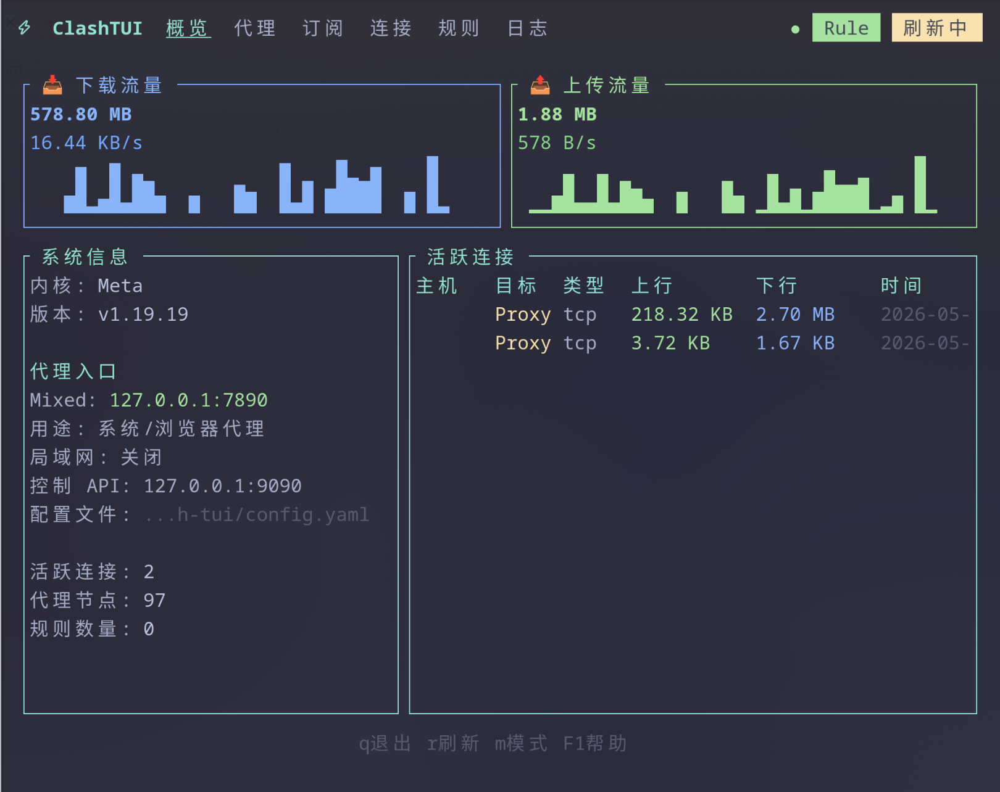

# Clash TUI

An htop-like terminal UI for Clash/Mihomo. It ships with a bundled Mihomo core in release packages, so first startup does not depend on downloading a core at runtime.



## Features

- Terminal dashboard for traffic, connections, proxy groups, providers, rules, and logs
- Bundled Mihomo core support for offline-friendly installs
- Subscription add/edit/delete/update flows from the TUI
- Live proxy group switching and latency testing
- Clear proxy entry information, including mixed, HTTP, SOCKS, LAN, and controller ports
- File-based logs with daily rotation-friendly paths
- Daemon mode for background subscription updates

## Quick Start

### Install

```bash
# Option 1: install from this repository
./install.sh

# Option 2: install with Make
make install

# Option 3: build and copy manually
make release
sudo cp target/release/clash-tui /usr/local/bin/
```

`make install` and `./install.sh` expect a Mihomo binary to be available locally, for example at `third_party/mihomo/<platform>-<arch>/mihomo` or `bin/mihomo`. Release archives created by `make dist` include that core under `bin/mihomo`.

### Run

```bash
# Start the TUI. This is the default command.
clash-tui

# Start explicitly in TUI mode.
clash-tui tui

# Run background subscription updates.
clash-tui daemon

# Show current process/core status.
clash-tui status

# Stop the Mihomo core managed by clash-tui.
clash-tui stop

# Restart the Mihomo core.
clash-tui restart

# Quit clash-tui and the managed Mihomo core.
clash-tui quit

# Use a specific config file.
clash-tui -c ~/.config/clash/config.yaml
```

If another instance is already running, `clash-tui` prints the current status instead of starting a second TUI.

## Using The TUI

Common shortcuts:

| Key | Action |
| --- | --- |
| `1`-`6` | Switch tabs |
| `Tab` / `Shift+Tab` | Next / previous tab |
| `r` or `F5` | Refresh data |
| `m` or `F6` | Switch Clash mode |
| `F1` | Toggle help |
| `q` or `F10` | Quit |

Proxy tab shortcuts:

| Key | Action |
| --- | --- |
| `Up` / `Down` | Move selection |
| `Left` / `Right` | Switch to previous / next node in the selected group |
| `Enter` or `Space` | Open node picker |
| `s` | Test latency for the selected proxy group |
| `S` | Test latency for all proxy groups |
| `/` | Search |
| `F4` | Sort |

Provider tab shortcuts:

| Key | Action |
| --- | --- |
| `a` | Add provider |
| `e` | Edit provider |
| `d` | Delete provider |
| `u` | Update selected provider |
| `U` | Update all providers |
| `h` | Run provider health check |

## Proxy Ports

The overview tab shows the ports that can actually be used by your system or browser:

| Field | Meaning |
| --- | --- |
| `Mixed` | Mixed HTTP/SOCKS proxy, usually the main browser/system proxy |
| `HTTP` | HTTP proxy port, if enabled |
| `SOCKS` | SOCKS proxy port, if enabled |
| `LAN` | Whether remote LAN clients are allowed |
| `Controller API` | Mihomo external controller address, used by the TUI |

Default generated config:

```yaml
mixed-port: 7890
external-controller: 127.0.0.1:9090
allow-lan: true
bind-address: '*'
mode: rule
log-level: info
```

For a local browser or OS proxy, use `127.0.0.1:7890` when `mixed-port` is enabled.

## Configuration

Config lookup order:

1. Path passed with `-c` / `--config`
2. `~/.config/clash-tui/config.yaml`
3. Existing Mihomo/Clash config locations detected by the app
4. `./config.yaml`

When no config exists, clash-tui creates a minimal Mihomo config with one `Proxy` selector and `DIRECT` fallback so the TUI can start immediately. Add your subscription in the Providers tab.

Local runtime files such as `config.yaml`, `cache.db`, and `target/` are ignored by git.

## Logs

Application logs are written to files by default:

- macOS: `~/Library/Application Support/clash-tui/logs/`
- Linux: `~/.config/clash-tui/logs/`

Useful commands:

```bash
# Follow the latest TUI log.
tail -f ~/.config/clash-tui/logs/clash-tui.log

# Follow the bundled core log.
tail -f ~/.config/clash-tui/logs/mihomo-core.log

# Increase log verbosity.
clash-tui --log-level debug
RUST_LOG=debug clash-tui
```

## Build

```bash
# Fast development build.
make build

# Run from source.
cargo run

# Optimized release build.
make release

# Single-binary release build with Mihomo embedded.
make release-embedded MIHOMO_BIN=/path/to/mihomo

# Small optimized build.
make mini

# Create a sidecar release archive: clash-tui + bin/mihomo.
make dist MIHOMO_BIN=/path/to/mihomo

# Create a single-binary release archive with Mihomo embedded.
make dist-embedded MIHOMO_BIN=/path/to/mihomo

# Create both release archive types.
make dist-all MIHOMO_BIN=/path/to/mihomo
```

## Development

```bash
cargo fmt --check
cargo test
cargo clippy --all-targets --all-features -- -D warnings
```

## Requirements

- Rust 1.75+
- macOS or Linux
- A platform-matching Mihomo binary when installing or packaging

## License

MIT
